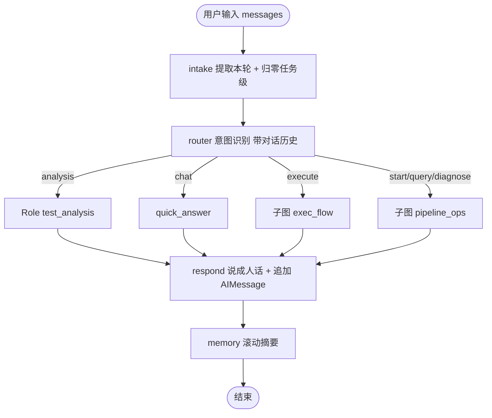
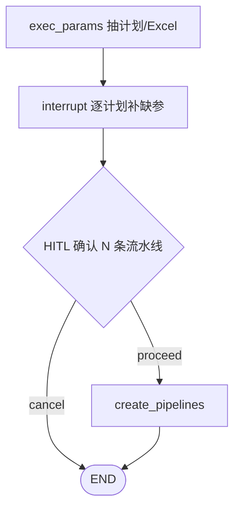
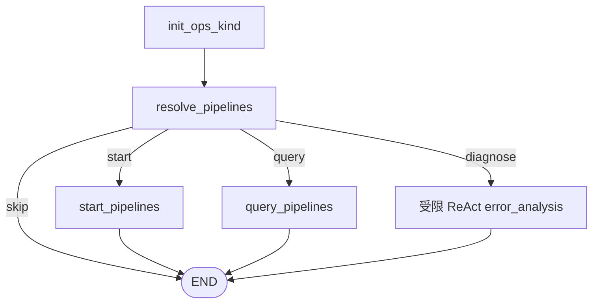
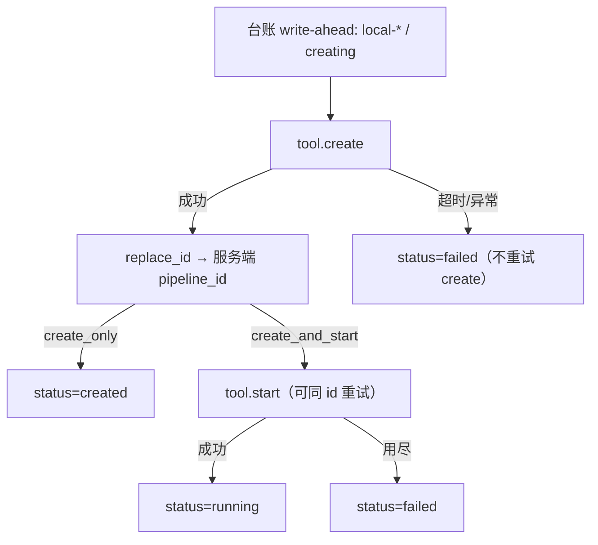

# 测试专属 Agent 架构设计（讨论稿 v0.5）

命令行 Agent，给测试人员用。编排框架用 LangGraph。
公司真实 tool 尚未接入，全部 mock，接口契约按真实系统设计，后续替换实现即可商用。

MVP 范围：**到「创建并启动流水线 + 可查询进度」为止**。最终结果用户去流水线前端看；归因、环境自动修复、用例自动生成放 Phase 2。

## 一、核心设计原则

1. **主干是确定性状态机。** 流程阶段固定、每步有明确产物，用 `StateGraph` 显式编排。自由推理只发生在单个节点内部。可审计、可复现是商用前提。

2. **一个模型 + 多套 prompt = 多个角色。** 不为每个「agent」起独立模型。测试分析 agent 本质是「主模型 + 加载了测试分析 skill 的 system prompt」。

3. **所有公司系统调用走 Protocol 抽象。** 图只依赖 Protocol，接真实 tool 时不改图。

4. **触发执行这类写操作必须人工确认。**

## 二、什么时候该用子 agent（重要判定标准）

「需要调 tool」不是子 agent 的理由。**门槛是需不需要自主决策。**

满足下面任意两条，才升级为 Role（LLM 驱动的子 agent）：

1. 下一步做什么取决于上一步结果，且分支无法穷举
2. 需要在多个 tool 之间自主选择、可能反复调用
3. 输出是开放文本，需要迭代打磨

对照本项目：

| 能力 | 判定 | 结论 |
|------|------|------|
| 执行用例 | 步骤固定：抽参数 → 确认 → create → 可选 start → 拿 pipeline_id | **确定性 Flow**，LLM 只做一次参数抽取 |
| 查执行结果 | 步骤固定：定位 pipeline → 调 tool → 呈现 | **确定性 Flow**，LLM 只做指代消解 |
| 测试分析 | 开放文本 + 需要重写迭代 | **Role**（LLM 驱动） |
| 结果归因（Phase 2） | 要读日志、按线索决定查什么 | **Role + tools** |

所以术语统一为三层：

| 类型 | 含义 | 实例 |
|------|------|------|
| Tool | 确定性外部调用 | 拉用例、执行用例、查结果、查日志 |
| Flow | 确定性子图，步骤固定，LLM 仅做结构化抽取 | 执行流、查询流 |
| Role | 主模型 + skill + 输出契约，需要自主推理 | 测试分析、结果归因 |

口诀：**能写成函数的是 tool，步骤能画死的是 flow，需要边想边试的才是 role。**

## 三、Skill 机制：markdown 即角色包

```text
skills/
  test_analysis/
    SKILL.md          # 角色定义 + 分析方法论 + 步骤要求
    template.md       # 输出结构模板
    references/       # 规格与业务资料 markdown（先模拟公司资料）
      256T_downlink.md
```

`load_skill("test_analysis")` 把 `SKILL.md` + `template.md` + `select_references` 检索到的资料拼进 system prompt。

**本地混合 RAG**：[`retrieval.py`](../work_agent/core/retrieval.py) 对 markdown 切块，BM25∥Embedding→RRF→top_k（可降级纯 BM25）；供 mock 知识检索与 skill references。

**公司 w3 MCP Client**：`TOOL_BACKEND=real` 时 `RealKnowledgeSearchTool` 经 [`w3_client.py`](../work_agent/mcp/w3_client.py) 调用 `w3_search`（stdio 或 streamable HTTP）。未配置 `W3_MCP_*` 或调用失败时返回错误字符串，不打断诊断主路径。

产物落盘保证可追溯：

```text
workspace/
  runs/<task_id>/
    task.json           # 任务元数据与参数
    test_analysis.md    # 测试分析产物
    cases.json          # 本次用例集
    run_result.json     # 执行结果原始数据
    report.md           # 最终报告
  index.db              # 运行台账（跨会话查询用）
```

## 四、参数解析：物理环境与优先级链

执行 tool 现阶段入参是 **物理组网 IP**（如 `7.223.50.60`）。逻辑组网（如 `3BBL_86_1BBL86` / 「85+86 环境」）后续靠型号映射 markdown 解析，当前识别到会 interrupt 提示改传物理 IP。

一次用户输入可拆成 **多条执行计划**：不同环境各一次 `create`（多个 `pipeline_id`）；同一环境多个用例合并为一条（批量 `case_names`）。`exec_mode`：`create_only`（只建不跑）或 `create_and_start`（默认，创建并启动）。

参数来源优先级：


| 参数 | 缺失时行为 |
|------|-----------|
| `case_names` | 缺失则 interrupt 询问；agent **不预校验**用例名，流水线自己验证 |
| `version` | 枚举 `27B/27A/26B/26A`；本轮未说则 interrupt，**不静默填默认** |
| `env` | 物理 IP；**不允许静默填充**；逻辑组网写法视为缺失并提示 |
| `exec_mode` | 默认 `create_and_start`；用户说「只创建」则为 `create_only` |

个人配置放 `config/profile.yaml`：

```yaml
default_version: "27B"
frequent_topologies: ["topo_a", "topo_b"]
poll_interval_seconds: 30
poll_max_attempts: 40
create_retry_attempts: 1
```

环境必须问，是因为跑错环境代价高。`poll_*` 配置保留但执行链路已不再轮询；`create_retry_attempts` 控制 **start** 失败后的同 `pipeline_id` 重试次数（create 失败不盲目重试，防双建）。

## 五、主流程



执行子图 `exec_flow` 内部：



已有流水线子图 `pipeline_ops`：



`create_pipelines`（`pipeline_id` 由服务端返回；create 失败不盲目重试）：



子图用独立 schema：`ExecFlowInput` / `PipelineOpsInput` 等。`audit` 只出不进。问进度走 `pipeline_ops`/`query`；「只创建」后再启动走 `start`；失败归因走 `diagnose`（ReAct，知识库本期可空）。

### error_analysis 内部：显式 Agent Loop

`error_analysis` 需要「边想边试」（先查状态、再抓日志、必要时查知识库），是全图唯一的 Role 节点。早期用 `langgraph.prebuilt.create_react_agent` 搭起来，能跑但是个黑盒：内部循环、消息拼接、停止时机全在库代码里，不好单测、也不好挂进度上报。现在改成了显式函数 `run_agent_loop`（`work_agent/graph/helpers/agent_loop.py`）：

```python
for step in range(max_steps):
    report_progress("status:thinking")
    ai_msg = bound_model.invoke(messages)
    ...  # 按白名单执行 tool_calls，compress_observation 压缩后塞回 ToolMessage
    if step == max_steps - 1:
        messages.append(HumanMessage(content=_STOP_HINT))  # 强制收尾，逼模型收敛
        ...
```

要点：

- 工具白名单在函数内部按 `tools_by_name` 匹配，未注册工具直接返回拒绝文案，不抛异常，不影响循环继续；
- 每步显式调用 `report_progress`，CLI 状态条不用再挂 `BaseCallbackHandler`；
- 单测只需 mock 一个只有 `bind_tools` / `invoke` 两个方法的假 model，不用起真图、真 LLM（见 `tests/test_agent_loop.py`）。

`error_analysis` 节点只负责组装 `system` / `tools` / `human` 交给循环，循环本身与具体业务无关，理论上可复用给其他「受限 ReAct」场景。

### respond + memory

分支节点产出的 `summary` 是给报告、台账和程序看的结构化数据。`respond` 把本轮事实组织成中文回答，写入 `state.reply`，并追加 `AIMessage`。随后 `memory`：消息超过 12 条时，把窗口外旧对话压进会话级 `dialogue_summary`，用 `RemoveMessage` 裁到最近 8 条；阈值以下直通。router / exec_params 注入的是「历史摘要 + 最近对话」。
## 六、运行台账：支撑「前面那次执行怎么样了」

checkpointer 只按 `thread_id` 存图状态。用户换会话再问「上次执行怎么样了」时，需要能跨会话查到流水线，所以额外建一张台账表 `pipelines`：

| 字段 | 说明 |
|------|------|
| `pipeline_id` | 服务端返回的流水线 id（主键）；创建中临时用 `local-*` |
| `task_id` | 本地任务 id（同一任务可对应多条流水线 / 多环境） |
| `case_names` / `version` / `env` | 执行参数（env=物理 IP） |
| `status` | 最后已知状态（creating / created / running / …） |
| `created_at` / `updated_at` | 时间戳 |
| `user_id` | 创建者工号（如 `z00888363`）；写入/查询全链路已按它隔离，见下方「历史回填」 |

`pipeline_ops` 内 resolve / query / start 共用台账消解规则，按顺序尝试：

1. 用户明确给了 pipeline_id 或用例名，直接匹配台账
2. 说「上次 / 前面那次 / 那几条」，取最近一条所属 task 的全部流水线，逐条 `query` 或 `start`
3. 台账为空或跨 task 有歧义，interrupt 列出候选让用户选

这就是为什么查询 / 启动类**不需要**子 agent：规则能穷举，用不着让模型自由探索。

### 存储后端：本地 SQLite / 上线 Postgres 双模式

`checkpointer`（`core/checkpoint.py`）、台账（`core/ledger.py`）和个人配置（`core/user_config.py`）都按同一个规则选后端：`POSTGRES_DSN` 配了用 Postgres（`PostgresSaver` / `PostgresLedger` / `PostgresUserConfigStore`，走 `core/db.py` 共享的 `psycopg_pool.ConnectionPool`），没配就退回本地 SQLite（`SqliteSaver` / `RunLedger` / `SqliteUserConfigStore`，分别落在 `workspace/checkpoints.sqlite`、`workspace/index.db`、`workspace/user_config.db`）。本地开发用 `docker-compose.yml` 起一个 Postgres 容器（`docker compose up -d`），`.env` 里配好 `POSTGRES_DSN` 即可切到真实库，不用改代码。

两个后端方法签名完全对齐：`checkpoint.py` 用 `query_recent_threads` / `thread_checkpoint_exists` 把「拿原始连接、拼 SQL」这层后端差异封起来，`sessions.py` 不关心底层是哪个库；`ledger.py` 用 `LedgerProtocol`，`user_config.py` 用 `UserConfigStore`，各自双实现。

`pipelines.user_id` 存的是工号字符串，不是（未来）用户表的 int 主键——工号是从鉴权拿到的稳定业务身份，台账没必要为了一个代理键去 join 一张现在还不存在的用户表。查询方法（`get` / `latest` / `find_by_case` / `find_by_task` / `list_recent`）都支持可选的 `user_id` 过滤参数：`None` 表示不过滤（现在没有任何生产调用点这么用，只留给管理/调试场景），其余情况下都真的按传入的工号过滤——所有写入路径（`exec_flow.py` 建流水线）和读取路径（`pipeline_resolve.py` 的 start/query/diagnose 消解、`diagnose_tools.py` 的 `find_case_history`、CLI 的 `runs` 命令）都已经把 `state["user_id"]` / `_USER_ID` 传进去了。

**历史回填**：身份接线之前创建的记录 `user_id` 全是空串，直接打开过滤会让这些老记录“查不到”。解决办法是让 `RunLedger._init_db()` / `PostgresLedger._ensure_table()` 在建表之后顺手跑一条 `UPDATE pipelines SET user_id=? WHERE user_id=''`，把历史空值统一改成 `core/identity.py` 的 `DEFAULT_USER_ID`（即未配 `WORK_AGENT_USER_ID` 时的默认身份 `local-dev`）——语义上等价于“以前没人配工号时的数据，就属于这个默认身份”，跟现在没配工号的 CLI 查询用的身份完全对齐。这条语句和建表一样是幂等操作，回填完之后每次启动都是 0 行受影响的空操作，没有引入单独的迁移脚本或版本号表。空串本身作为过滤值时（某处没拿到身份的兜底）语义是“过滤到这个身份”，回填后台账里不会再有这个身份的行，效果是“看不到任何记录”而不是“看到别人的”，失败方向更安全。

个人配置表 `user_config` 的 `config` 列存 JSON blob（`{"debug_mode": true, ...}`），不是一列一个字段——和台账里 `case_names` 的存法一致，以后加新偏好字段不用改表结构。`update` 是合并语义（只覆盖传入的键）。`get_debug_mode` 返回 `None` 表示用户从未设置过，交给调用方套系统默认值，不要把「未设置」和 `False` 混为一谈。CLI 侧身份来源见 `core/identity.py`（`EnvIdentityProvider` 读 `WORK_AGENT_USER_ID`）；HTTP 侧仍用 `api/identity.py` 的请求级 mock 鉴权——两者调用形状不同（进程级 vs 请求级），不硬套同一个类。

测试策略：`tests/test_storage_backend.py` / `tests/test_user_config.py` 验证「DSN 为空 → 落回 SQLite」这条回退路径，不需要真实库，始终跑；`tests/test_postgres_integration.py` 端到端验证 Postgres 后端（checkpointer 跨「进程」持久化、ledger CRUD、`user_id` 隔离、user_config CRUD），模块级 `skipif` 探测 DSN 是否配置、连接是否可达，连不上就整份跳过，不阻塞没有本地 Postgres 的机器。

## 七、Tool 契约

```python
class CaseProvider(Protocol):
    def list_cases(self, query: str | None = None) -> list[CaseInfo]: ...
    def fetch_cases(self, names: list[str]) -> list[CaseInfo]: ...

class PipelineTool(Protocol):
    def create(
        self,
        case_names: list[str],
        version: str,
        env: str,
        options: dict[str, Any] | None = None,
    ) -> PipelineHandle: ...
    def start(self, pipeline_id: str) -> bool: ...
    def query(self, pipeline_id: str) -> PipelineResult: ...
```

Agent 侧命名纯净：`create` / `start` / `query`。`pipeline_id` **由服务端返回**。公司 SDK 放 `external/`，拼写怪异的公司函数名只在 `tools/real/` 做映射，不污染 Protocol。

`create` 的 `options` 是可选开关的收纳参数（目前只有 `debug_mode`），新增开关都进这个 dict 内部字段，不再逐个改 Protocol 签名。`debug_mode` 的值从哪来见「八、状态设计」——本轮用户口头明确提及时用本轮值，否则兜底 `state["debug_mode"]`（当前会话的持久调测偏好）。Mock 只把 `options` 记录进内部记录（`_PipelineRecord.options`），不模拟公司 API 对它的行为差异；`RealPipelineTool` 接入时把 `options` 摊平进公司请求体即可，Protocol/图不用再改。

Mock 行为可配置四场景：全通过、版本失败、用例报错、环境不可用。`query` 用 tick 模拟分钟级执行进度；未 `start` 时 phase=`created`。

## 八、状态设计

字段分两层：

| 层级 | 字段 | 生命周期 |
|------|------|----------|
| 会话级 | `messages`（`add_messages`）、`dialogue_summary` | 跨轮累积，intake 不重置 |
| 任务级 | 其余字段 | 每轮由 `intake` 显式归零 |

```python
class TestFlowState(TypedDict):
    # 会话级
    messages: Annotated[list[AnyMessage], add_messages]
    dialogue_summary: str          # 滚动摘要；memory 节点维护

    # 任务级：路由与产出
    task_id: str
    user_input: str                # intake 从 messages[-1] 提取
    intent: str                    # analysis | execute | start | query | chat
    requirement: str
    analysis_path: str
    exec_params: dict              # {plans: [...], exec_mode: create_only|create_and_start}
    pipelines: list[dict]          # [{pipeline_id, case_names, version, env, status, error}, ...]
    results: list[dict]            # query_pipelines 聚合的用例结果
    summary: dict                  # 只放汇总量，见下
    reply: str
    audit: Annotated[list[dict], append_audit]
```

**单一事实来源约定：**

- 路由读 `intent` / 子图内 `exec_decision`，不读 `summary`
- 引用性字段（`pipelines` / `analysis_path` / `exec_params`）只在顶层
- `summary` 只放汇总量：`status` / `message` / `answer` / `total` / `passed` / `failed_count` / `failed` / `created` / `failed_pipelines` / `exec_mode`
- 不写 `summary["branch"]`（与 `intent` 永远相等，属冗余）

执行私有字段在子图 `ExecFlowState`：仅 `exec_decision`。

调用方只传 `{"messages": [HumanMessage(...)]}`；任务级重置由 intake 负责，不再维护外部 `empty_state` 清单。

## 九、实施路线：小模块拆分

每个模块几十到两百行，配一个 LangGraph 知识点，做完就能跑。

| 模块 | 内容 | 学到的 LangGraph 知识 | 规模 |
|------|------|----------------------|------|
| M1 | `graph/state.py` + 最小串行图（两个纯 Python 节点） | State / Node / Edge / compile / invoke | 约 80 行 |
| M2 | `core/config.py` 配置与个人默认值 | 无（工程基建） | 约 70 行 |
| M3 | `core/llm.py` Gemini 封装 + 连通性验证 | LLM 接入与结构化输出 | 约 60 行 |
| M4 | `router` 意图识别节点 | `add_conditional_edges` 条件路由 | 约 90 行 |
| M5 | `tools/protocols.py` 契约与数据模型 | 无（契约设计） | 约 90 行 |
| M6 | `tools/mock/` 可配置四场景 mock | 无（可测性） | 约 130 行 |
| M7 | `exec_params` + `create_pipelines` / `start_pipelines` | 多计划 create + 按需 start | 约 150 行 |
| M8 | （已移除轮询） | — | — |
| M9 | （已移除执行报告落盘；结果看流水线前端） | — | — |
| M10 | SQLite checkpointer + thread_id | 持久化与断点恢复 | 约 80 行 |
| M11 | interrupt 补参数与执行前确认 | `interrupt` / `Command(resume)` | 约 110 行 |
| M12 | `skills/` 目录 + `SkillLoader` | prompt 组装 | 约 90 行 |
| M13 | `test_analysis` Role 节点 | Role 抽象与产物落盘 | 约 110 行 |
| M14 | 运行台账 + 查询/启动已有流水线 | 跨会话状态查询与启动 | 约 120 行 |
| M15 | CLI REPL（typer + rich） | 与图的交互层 | 约 130 行 |
| M16 | mock 场景切换 + 端到端测试 | 图的可测试性 | 约 120 行 |

顺序说明：M1 先用纯 Python 节点建立对图的直觉，不引入 LLM 的不确定性；M3 之后才开始接模型。

## 十、Phase 2（本期不做，架构留位）

- 结果自动归因三分类：版本问题 / 用例异常 / 环境异常
- 版本问题自动提单（`DefectTracker` Protocol）
- 环境异常自动换环境重试（`EnvPool` Protocol）
- 用例自动生成（`case_build` Role）

留位方式：Protocol 里定义好签名，`tools/real/` 放空实现抛 `NotImplementedError`，图里不接线。公司 SDK 放 `external/`。

## 十一、技术选型

**模型接入统一走 OpenAI 兼容协议**，这样公司网关和 Gemini 用同一套代码，切换只改配置。

`core/llm.py` 只暴露一个工厂函数，全项目不允许别处直接构造模型客户端：

```python
def get_chat_model(*, temperature: float | None = None, model: str | None = None) -> BaseChatModel:
    return ChatOpenAI(
        model=model or settings.llm_model,
        base_url=settings.llm_base_url,
        api_key=settings.llm_api_key,
        temperature=temperature if temperature is not None else settings.llm_temperature,
        timeout=settings.llm_timeout,
        max_retries=settings.llm_max_retries,
    )
```

学习阶段配置（Gemini 的 OpenAI 兼容端点）：

```ini
LLM_BASE_URL=https://generativelanguage.googleapis.com/v1beta/openai/
LLM_API_KEY=${GEMINI_API_KEY}
LLM_MODEL=gemini-2.5-flash
```

切公司环境只改这三行指向内部网关。注意该端点只支持 `/chat/completions`，不支持 `/responses`，`ChatOpenAI` 走的正是前者。M3 会带一个连通性自检命令，顺便拉一次 `/models` 列表确认当前可用模型 ID。

### 快/慢模型路由：按 Flow/Role 分工，不是一刀切同一个模型

节点本来就按 **Tool/Flow/Role** 分类（见「一、核心设计原则」）：Flow 是单次结构化抽取/分类，没有多步推理；Role 是开放式多步推理（ReAct 循环、长文本生成）。这个分类天然对应"该用便宜快模型"还是"该用强模型"，所以路由不是新概念，只是把已有分类兑现成两个模型参数：

```python
# core/config.py：未配对应环境变量时都退回 llm_model（现有单模型部署零改动）
llm_fast_model: str        # os.getenv("LLM_FAST_MODEL") or llm_model
llm_reasoning_model: str   # os.getenv("LLM_REASONING_MODEL") or llm_model

# core/llm.py：内部转调已有 get_chat_model()，不新增调用协议
def get_fast_model(*, temperature=None) -> BaseChatModel: ...
def get_reasoning_model(*, temperature=None) -> BaseChatModel: ...
def invoke_text_fast(messages, *, temperature=None) -> str: ...
def invoke_text_reasoning(messages, *, temperature=None) -> str: ...
```

调用点按 Flow/Role 对号入座：

| 节点 | 用途 | 分类 | 模型 |
|------|------|------|------|
| `router.py` | 意图分类 | Flow | fast |
| `exec_flow.py` `exec_params`/列映射 | 结构化抽取 | Flow | fast |
| `error_analysis.py` ReAct 主循环 | 开放式多步取证归因 | Role | reasoning |
| `error_analysis.py` 二次结构化抽取 | 从归因文本里抽字段 | Flow | fast |
| `analysis.py` `test_analysis` | 生成测试分析文档 | Role | reasoning |
| `chat.py`/`respond.py`/`memory.py` | 轻量问答/转述/摘要 | Flow | fast |

同一个 OpenAI 兼容网关，只是 `model` 参数不同，不涉及多套 `base_url`/`api_key`；若后续证实快慢模型分属不同网关，再加一组独立配置，不影响这次的调用点改造。

### Policy 表：权限规则集中化

「create/start 需要确认」「diagnose 白名单只读」以前是散落在各处的手写约定（`diagnose_tools.py` 手工只注册只读函数、`hitl.py` 手写 `interrupt()`），没有一份可审计、可测试的集中定义。`core/policy.py` 把这些事实收拢成一份表：

```python
@dataclass(frozen=True)
class ActionPolicy:
    name: str
    read_only: bool
    requires_confirmation: bool
    description: str = ""

POLICIES: dict[str, ActionPolicy] = {
    "create_pipeline": ActionPolicy(..., read_only=False, requires_confirmation=True),
    "start_pipeline": ActionPolicy(..., read_only=False, requires_confirmation=True),
    "get_pipeline_status": ActionPolicy(..., read_only=True, requires_confirmation=False),
    # ... 其余 diagnose 白名单工具、set_mode
}
```

`build_diagnose_tools()` 构造完 6 个只读工具后调用 `assert_read_only_whitelist([t.name for t in tools])`：谁把一个非只读工具误加进这份白名单，构造期（首次调用）就直接抛 `ValueError`，不用等到真跑起来才发现诊断链路里混进了写操作。`hitl.py` 的 `confirm_exec()` 在 `interrupt()` 调用前加注释引用 `POLICIES["create_pipeline"].requires_confirmation`，让"为什么这里要停下来确认"可追溯到这张表，而不是新增一层运行时权限判断——当前规模下这就是一份静态事实表，不是 RBAC 引擎。

其他选型：

- CLI：`typer` + `rich`，PowerShell 直接可用
- 持久化：`langgraph-checkpoint-sqlite`
- 已装：langgraph 1.2.10、langchain 1.3.14、langchain-openai（无需再装 google 专用包）

## 十二、从 MVP 到商用的加固清单

M1 到 M16 产出的是**端到端跑得通的最小闭环**，约 1500 到 1800 行。商用级的成本不在主干流程，而在下面这些边界与可靠性工作，这部分才是大头（含测试约 6000 到 10000 行）。

| 加固项 | 具体内容 | 阶段 |
|--------|----------|------|
| 错误处理与重试 | tool 调用失败、网络超时、LLM 限流的分级重试与降级 | 闭环跑通后立刻做 |
| 幂等与防重 | create 失败不盲目重试（防双建）；start 可同 pipeline_id 重试 | 同上 |
| 参数校验 | 用例名/版本/组网的合法性前置校验，避免无效执行 | 同上 |
| 结构化日志与审计 | 谁在何时触发了什么执行、用了什么参数，可回溯 | 同上 |
| 结果解析健壮性 | 日志格式变化、部分成功、超时未结束等情况 | 接真实 tool 时 |
| 并发执行 | 多组网或多版本并行跑，结果聚合 | 需求出现时 |
| 配置分层 | 默认值 / 项目配置 / 用户配置 / 命令行覆盖 | 逐步 |
| 权限与密钥 | 谁能触发执行、key 管理、日志脱敏 | 上线前必须 |
| prompt 回归评测 | 测试分析质量的固定评测集，改 prompt 不退化 | 接真实资料后 |
| 可观测性 | 每步耗时、token 消耗、失败率 | 逐步 |
| 测试矩阵 | mock 四场景 × 意图入口的端到端用例 | 与功能同步 |

**为什么先窄后深**：过早抽象是最大的浪费。只有真实跑过一遍流程，才知道哪些边界情况真的会发生。所以先把最小闭环打通，再在调测中逐层加固。

代码量本身不是质量指标。这套架构真正的价值是边界清晰：接公司真实 tool 时只需要写 `tools/real/` 下的实现（SDK 放 `external/`），图、Role、CLI 一行都不用改。

## 十三、Agent Gateway：CLI 之外的 HTTP 接入层

要部署到服务器给多用户用，CLI 单进程不够了，需要一个 HTTP 入口。`work_agent/api/`（`uvicorn work_agent.api.app:app`）就是这层——**图本身完全不用改**，只是把 `runtime.py` 换了一种被调用的方式，这也是这套架构在设计时就分离好「图 / CLI 壳」两层的收益。

### 两阶段 HITL 怎么搬到 HTTP 上

CLI 的 `run_turn`/`resume_pending` 是阻塞的：遇到 `interrupt` 就在进程里直接调 `ask()` 问人，问完接着跑，一次函数调用问几轮都行。HTTP 请求没法这样「一直挂着等前端弹窗」，所以新增了非阻塞版本 `run_turn_step`/`resume_step`（同在 `runtime.py`）：跑到底就直接返回结果，**跑到第一个 `interrupt` 也直接返回**，不在内部循环等答案。

对应三个端点：

- `POST /turns`：body 给 `message` + 可选 `thread_id`；没有 interrupt 直接拿到 `status=done` 的最终结果，有 interrupt 拿到 `status=waiting_input` + 原始载荷。
- `GET /turns/{thread_id}`：纯查询当前状态，不触发任何执行——客户端刷新页面/换设备后，原来那次 POST 响应里的载荷丢了，靠这个端点重新问一遍「这个会话现在是什么状态」，不用只靠前端自己缓存。底层是 `runtime.get_turn_status`，直接读 checkpointer 的 `get_state()`，不重新 invoke 图。
- `POST /turns/{thread_id}/resume`：body 给 `answer`，续跑一步；可能再拿到下一个 interrupt，也可能拿到最终结果；该会话没有 pending 时返回 404。

这和 CLI 用的图、checkpointer 是同一套，区别只在“谁来问 ask()”——CLI 里是终端 `input()`，HTTP 里是前端拿到 `waiting_input` 后自己渲染 UI，用户填完再发一次 `resume`。

“会话状态是否等待中”本身没有单独落一张状态表（没有 `WAITING_APPROVAL` 这种显式字段）——单一数据源就是 checkpointer：`get_state().next` 非空即为等待。多一张状态表反而要操心两处状态不同步的问题，checkpointer 本来就是权威来源，没必要重复记账。

### 鉴权：先 mock，形状对齐真实鉴权

`api/identity.py` 的 `HeaderIdentityProvider` 只读 `X-User-Id` 请求头校验个格式，不做真实鉴权——公司侧鉴权没接入前，先用这层把「网关按用户隔离会话/台账」的完整链路跑通。换成真实鉴权时只改这个类的内部实现（解析真实 token/session 拿工号），路由层 `Depends(get_current_user_id)` 的调用形状不用变。

会话隔离没有单独建映射表：新建会话时 `thread_id` 直接用 `{工号}-{随机串}` 当前缀（`runtime.new_thread_id(prefix=user_id)`），`GET /sessions` 和跨用户访问校验都靠这个前缀约定，省了一张表。CLI 和 API 两个入口现在共用这一套：CLI 启动时 `EnvIdentityProvider` 读一次 `WORK_AGENT_USER_ID`（未配退回 `local-dev`），`cli.py` 里所有 `new_thread_id()` 调用都带上这个工号当前缀，跟 API 生成 thread_id 的规则完全一致。

### 身份怎么从入口流进图状态

`state.py` 的 `user_id` 是会话级字段（`intake` 绝不重置，跟 `messages`/`dialogue_summary` 同类）：CLI/API 拿到工号后，`runtime.run_turn`/`run_turn_step` 把它和 `messages` 一起塞进每次 invoke 的 payload（`{"messages": [...], "user_id": user_id}`）——每轮都传、不依赖“只在第一轮写”，天然幂等。`resume_step`/`resume_pending` 续跑时不用再传：那一轮的 `user_id` 在 thread 创建时已经写进 checkpoint 了。

`debug_mode`（当前唯一的个人偏好）是任务级字段，但语义和其他任务级字段不一样：`intake` 不是把它归零，而是每轮都拿当前 `user_id` 去 `core/user_config.py` 重新查一次（`get_debug_mode`，未设置过时落成确定性的 `False`），这样换会话/换设备改了配置，当前会话下一轮就能看到新值。

用户要改这个偏好走一个新意图 `set_mode`（`router.py` 的 `RouteDecision` 加了 `debug_mode_target: bool | None` 字段，跟 `intent` 一次结构化输出里一起判断，不用为了拿"开启还是关闭"这一个布尔值再单独调一次模型；判断不出方向时留空、退回 `chat`，不强行分类）。`router` 只在 `intent=set_mode` 且方向明确时才把 `debug_mode_target` 写进 `state["debug_mode"]`，覆盖 `intake` 读到的旧值；新节点 `nodes/set_mode.py` 只管把这个已经确定的目标值落库（`set_debug_mode`）、产出 `summary`，不重新问模型。`respond.py` 给这个意图加了一条确定性直通回复（"已开启/关闭调试模式。"），跟 `chat` 分支一样不走 LLM 转述——事实只有一个布尔值，没什么好转述的，直通更快也不会说错。

`debug_mode` 不是只存不生效：`exec_flow.py` 的 `create_pipelines` 组装 `tool.create(..., options=...)` 时会读它兜底（本轮口头没提及时用 `state["debug_mode"]`，提及了则本轮值一次性覆盖，不回写 `user_config`），细节见「七、Tool 契约」。`ExecFlowInput`/`PipelineOpsInput` 都把 `debug_mode`（跟 `user_id` 一样）声明成子图 Input 字段，LangGraph 按同名字段自动从父图 state 灌进子图，不用额外接线代码。

### 并发：单进程内存锁，先够用

同一个 `thread_id` 不能被两个请求同时续跑（checkpointer 不是为并发写设计的）。`api/locks.py` 用一个进程内 `dict[thread_id, threading.Lock]` 做非阻塞互斥：抢不到锁直接 409，不排队等，避免请求堆在线程池里。这层锁只在单进程内有效，多副本部署需要换成 Postgres advisory lock 或分布式锁——当前单进程部署，先不做。

### 测试策略

- `tests/test_runtime_step.py`：mock 假 app（不调 LLM），验证 `run_turn_step`/`resume_step` 遇 interrupt 立刻返回、能正确串联多轮 resume。
- `tests/test_api_gateway.py`：用 `TestClient` + mock `runtime.run_turn_step`/`resume_step`，只测网关自己的逻辑（鉴权 401、跨用户 403、无 pending 404、并发 409、响应结构转换），图的正确性交给上面那层单测和各节点自己的测试。
