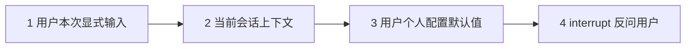
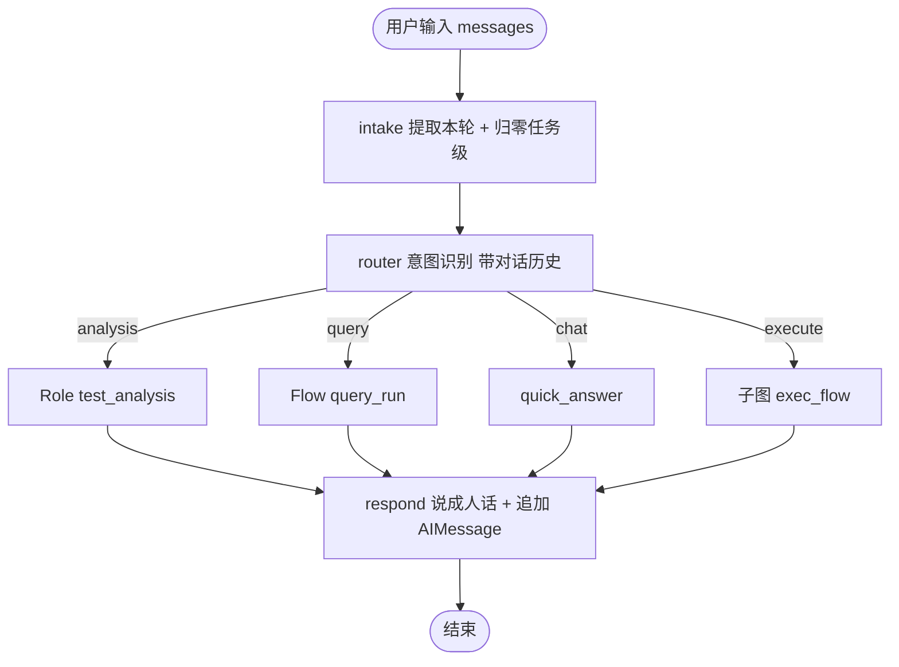
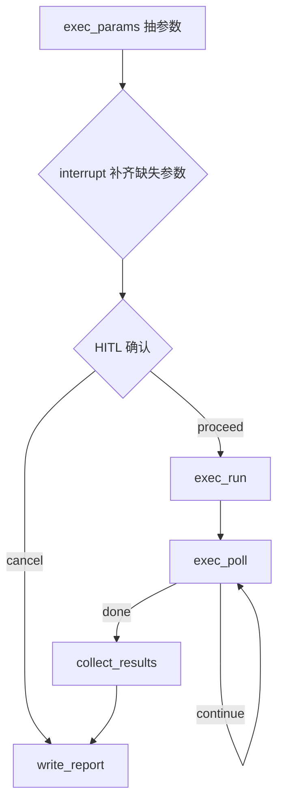

# 测试专属 Agent 架构设计（讨论稿 v0.4）

命令行 Agent，给测试人员用。编排框架用 LangGraph。
公司真实 tool 尚未接入，全部 mock，接口契约按真实系统设计，后续替换实现即可商用。

MVP 范围：**到「看到执行结果并生成报告」为止**。提单、环境自动修复、用例自动生成放 Phase 2。

## 一、核心设计原则

1. **主干是确定性状态机。** 流程阶段固定、每步有明确产物，用 `StateGraph` 显式编排。自由推理只发生在单个节点内部。可审计、可复现是商用前提。

2. **一个模型 + 多套 prompt = 多个角色。** 不为每个「agent」起独立模型。测试分析 agent 本质是「主模型 + 加载了测试分析 skill 的 system prompt」。

3. **所有公司系统调用走 Protocol 抽象。** 图只依赖 Protocol，接真实 tool 时不改图。

4. **触发执行这类写操作必须人工确认。**

## 二、什么时候该用子 agent（重要判定标准）

「需要调 tool」不是子 agent 的理由。**门槛是需不需要自主决策。**

满足下面任意两条，才升级为 Role（LLM 驱动的子 agent）：

1. 下一步做什么取决于上一步结果，且分支无法穷举
2. 需要在多个 tool 之间自主选择、可能反复调用
3. 输出是开放文本，需要迭代打磨

对照本项目：

| 能力 | 判定 | 结论 |
|------|------|------|
| 执行用例 | 步骤固定：抽参数 → 确认 → 调 tool → 拿 run_id | **确定性 Flow**，LLM 只做一次参数抽取 |
| 查执行结果 | 步骤固定：定位 run → 调 tool → 呈现 | **确定性 Flow**，LLM 只做指代消解 |
| 测试分析 | 开放文本 + 需要重写迭代 | **Role**（LLM 驱动） |
| 结果归因（Phase 2） | 要读日志、按线索决定查什么 | **Role + tools** |

所以术语统一为三层：

| 类型 | 含义 | 实例 |
|------|------|------|
| Tool | 确定性外部调用 | 拉用例、执行用例、查结果、查日志 |
| Flow | 确定性子图，步骤固定，LLM 仅做结构化抽取 | 执行流、查询流 |
| Role | 主模型 + skill + 输出契约，需要自主推理 | 测试分析、结果归因 |

口诀：**能写成函数的是 tool，步骤能画死的是 flow，需要边想边试的才是 role。**

## 三、Skill 机制：markdown 即角色包

```text
skills/
  test_analysis/
    SKILL.md          # 角色定义 + 分析方法论 + 步骤要求
    template.md       # 输出结构模板
    references/       # 规格与业务资料 markdown（先模拟公司资料）
      256T_downlink.md
```

`load_skill("test_analysis")` 把 `SKILL.md` + `template.md` + `references/*.md` 全量拼进 system prompt。

**现阶段不做 RAG**：资料量小，全量注入准确率更高、无检索误差。`SkillLoader` 预留 `select_references(query)` 钩子，将来资料变多换检索实现，调用方不改。

产物落盘保证可追溯：

```text
workspace/
  runs/<task_id>/
    task.json           # 任务元数据与参数
    test_analysis.md    # 测试分析产物
    cases.json          # 本次用例集
    run_result.json     # 执行结果原始数据
    report.md           # 最终报告
  index.db              # 运行台账（跨会话查询用）
```

## 四、参数解析：逻辑组网与优先级链

**逻辑组网** 是执行 tool 的入参，一个逻辑组网对应多套物理环境，物理环境由公司平台调度，本项目不管。

参数来源优先级：



| 参数 | 缺失时行为 |
|------|-----------|
| `case_names` | 缺失则 interrupt 询问，或列出可选用例让用户挑 |
| `version` | 可由个人配置默认值静默填充（如 `27B`），但必须在确认页展示 |
| `topology` | **即使配置里有默认值也必须 interrupt 确认**，不允许静默填充 |

个人配置放 `config/profile.yaml`：

```yaml
default_version: "27B"
frequent_topologies: ["topo_a", "topo_b"]
poll_interval_seconds: 30
poll_max_attempts: 40
```

组网必须问，是因为跑错组网的代价高，且逻辑组网到物理环境是一对多，agent 无从判断你要哪套。

## 五、主流程



执行子图 `exec_flow` 内部：



子图用独立 schema：`ExecFlowInput` / `ExecFlowOutput` / 私有字段（`cases` / `exec_decision` / `poll_count`）。`audit` 只出不进，避免父图 reducer 重复计入。

### respond：所有分支的统一出口

分支节点产出的 `summary` 是给报告、台账和程序看的结构化数据，直接丢给用户就是一堆字段。`respond` 是唯一的汇聚点，把本轮的确定性事实组织成一段中文回答，写入 `state.reply`，并追加 `AIMessage` 到 `messages`，供下一轮指代。CLI 只展示 `reply`。

两条约束：

- **不许编造**。run_id、用例名、版本、组网、路径、数量以 JSON 原样交给模型，prompt 里禁止改写。
- **不许中断**。它在所有分支的必经路径上，LLM 抖动不能让整轮任务失败，所以有确定性的兜底回复。

chat 分支的 `answer` 本来就是人话，直接透传。回复同时落盘为 `reply.md`。

## 六、运行台账：支撑「前面那次执行怎么样了」

checkpointer 只按 `thread_id` 存图状态。用户换会话再问「上次执行怎么样了」时，需要能跨会话查到 run，所以额外建一张台账表 `workspace/index.db`：

| 字段 | 说明 |
|------|------|
| `run_id` | 执行 tool 返回的 id |
| `task_id` | 本地任务 id |
| `case_names` / `version` / `topology` | 执行参数 |
| `status` | 最后已知状态 |
| `created_at` / `updated_at` | 时间戳 |

`query_run` 这个 Flow 的指代消解规则，按顺序尝试：

1. 用户明确给了 run_id 或用例名，直接匹配台账
2. 说「上次 / 前面那次」，取台账中最近一条
3. 台账为空或有歧义，interrupt 列出候选让用户选

这就是为什么查询类**不需要**子 agent：规则能穷举，用不着让模型自由探索。

## 七、Tool 契约

```python
class CaseProvider(Protocol):
    def list_cases(self, query: str | None = None) -> list[CaseInfo]: ...
    def fetch_cases(self, names: list[str]) -> list[CaseInfo]: ...

class Executor(Protocol):
    def run(self, case_names: list[str], version: str, topology: str) -> RunHandle: ...
    def status(self, run_id: str) -> RunStatus: ...
    def results(self, run_id: str) -> list[CaseResult]: ...
    def logs(self, run_id: str, case_name: str | None = None) -> str: ...
```

单个与批量执行统一成用例名列表，长度 1 就是单个，实现不分叉。

Mock 行为可配置，能造出四种结果：全通过、部分失败（版本问题特征）、用例本身报错、环境不可用。每条分支都能跑通。

## 八、状态设计

字段分两层：

| 层级 | 字段 | 生命周期 |
|------|------|----------|
| 会话级 | `messages`（`add_messages`） | 跨轮累积，intake 不重置，靠 checkpointer 持久化 |
| 任务级 | 其余字段 | 每轮由 `intake` 显式归零 |

```python
class TestFlowState(TypedDict):
    # 会话级
    messages: Annotated[list[AnyMessage], add_messages]

    # 任务级：路由与产出
    task_id: str
    user_input: str                # intake 从 messages[-1] 提取
    intent: str                    # analysis | execute | query | chat（单一事实来源）
    requirement: str
    analysis_path: str
    exec_params: dict              # 子图 output 写回
    run_id: str
    run_status: str
    results: list[dict]
    logs: str
    report_path: str
    summary: dict                  # 只放汇总量，见下
    reply: str
    audit: Annotated[list[dict], append_audit]
```

**单一事实来源约定：**

- 路由读 `intent` / 子图内 `exec_decision`，不读 `summary`
- 引用性字段（`run_id` / `report_path` / `analysis_path` / `exec_params`）只在顶层
- `summary` 只放汇总量：`status` / `message` / `answer` / `total` / `passed` / `failed_count` / `failed` / `progress`（以及 `missing`）
- 不写 `summary["branch"]`（与 `intent` 永远相等，属冗余）

执行私有字段在子图 `ExecFlowState`：`cases` / `exec_decision` / `poll_count`。`poll_count` 是轮询刹车，上限读 `profile.poll_max_attempts`。

调用方只传 `{"messages": [HumanMessage(...)]}`；任务级重置由 intake 负责，不再维护外部 `empty_state` 清单。

## 九、实施路线：小模块拆分

每个模块几十到两百行，配一个 LangGraph 知识点，做完就能跑。

| 模块 | 内容 | 学到的 LangGraph 知识 | 规模 |
|------|------|----------------------|------|
| M1 | `graph/state.py` + 最小串行图（两个纯 Python 节点） | State / Node / Edge / compile / invoke | 约 80 行 |
| M2 | `core/config.py` 配置与个人默认值 | 无（工程基建） | 约 70 行 |
| M3 | `core/llm.py` Gemini 封装 + 连通性验证 | LLM 接入与结构化输出 | 约 60 行 |
| M4 | `router` 意图识别节点 | `add_conditional_edges` 条件路由 | 约 90 行 |
| M5 | `tools/protocols.py` 契约与数据模型 | 无（契约设计） | 约 90 行 |
| M6 | `tools/mock/` 可配置四场景 mock | 无（可测性） | 约 130 行 |
| M7 | `exec_params` + `exec_run` 节点 | tool 调用与状态写回 | 约 100 行 |
| M8 | `exec_poll` 轮询自循环 | 循环边与终止上限 | 约 70 行 |
| M9 | `collect_results` + `report` 落盘 | 节点产物与文件副作用 | 约 100 行 |
| M10 | SQLite checkpointer + thread_id | 持久化与断点恢复 | 约 80 行 |
| M11 | interrupt 补参数与执行前确认 | `interrupt` / `Command(resume)` | 约 110 行 |
| M12 | `skills/` 目录 + `SkillLoader` | prompt 组装 | 约 90 行 |
| M13 | `test_analysis` Role 节点 | Role 抽象与产物落盘 | 约 110 行 |
| M14 | 运行台账 + `query_run` Flow | 跨会话状态查询 | 约 120 行 |
| M15 | CLI REPL（typer + rich） | 与图的交互层 | 约 130 行 |
| M16 | mock 场景切换 + 端到端测试 | 图的可测试性 | 约 120 行 |

顺序说明：M1 先用纯 Python 节点建立对图的直觉，不引入 LLM 的不确定性；M3 之后才开始接模型。

## 十、Phase 2（本期不做，架构留位）

- 结果自动归因三分类：版本问题 / 用例异常 / 环境异常
- 版本问题自动提单（`DefectTracker` Protocol）
- 环境异常自动换环境重试（`EnvPool` Protocol）
- 用例自动生成（`case_build` Role）

留位方式：Protocol 里定义好签名，`tools/real/` 放空实现抛 `NotImplementedError`，图里不接线。

## 十一、技术选型

**模型接入统一走 OpenAI 兼容协议**，这样公司网关和 Gemini 用同一套代码，切换只改配置。

`core/llm.py` 只暴露一个工厂函数，全项目不允许别处直接构造模型客户端：

```python
def get_chat_model(*, temperature: float | None = None, model: str | None = None) -> BaseChatModel:
    return ChatOpenAI(
        model=model or settings.llm_model,
        base_url=settings.llm_base_url,
        api_key=settings.llm_api_key,
        temperature=temperature if temperature is not None else settings.llm_temperature,
        timeout=settings.llm_timeout,
        max_retries=settings.llm_max_retries,
    )
```

学习阶段配置（Gemini 的 OpenAI 兼容端点）：

```ini
LLM_BASE_URL=https://generativelanguage.googleapis.com/v1beta/openai/
LLM_API_KEY=${GEMINI_API_KEY}
LLM_MODEL=gemini-2.5-flash
```

切公司环境只改这三行指向内部网关。注意该端点只支持 `/chat/completions`，不支持 `/responses`，`ChatOpenAI` 走的正是前者。M3 会带一个连通性自检命令，顺便拉一次 `/models` 列表确认当前可用模型 ID。

其他选型：

- CLI：`typer` + `rich`，PowerShell 直接可用
- 持久化：`langgraph-checkpoint-sqlite`
- 已装：langgraph 1.2.10、langchain 1.3.14、langchain-openai（无需再装 google 专用包）

## 十二、从 MVP 到商用的加固清单

M1 到 M16 产出的是**端到端跑得通的最小闭环**，约 1500 到 1800 行。商用级的成本不在主干流程，而在下面这些边界与可靠性工作，这部分才是大头（含测试约 6000 到 10000 行）。

| 加固项 | 具体内容 | 阶段 |
|--------|----------|------|
| 错误处理与重试 | tool 调用失败、网络超时、LLM 限流的分级重试与降级 | 闭环跑通后立刻做 |
| 幂等与防重 | 同一任务重复触发执行的拦截，run_id 去重 | 同上 |
| 参数校验 | 用例名/版本/组网的合法性前置校验，避免无效执行 | 同上 |
| 结构化日志与审计 | 谁在何时触发了什么执行、用了什么参数，可回溯 | 同上 |
| 结果解析健壮性 | 日志格式变化、部分成功、超时未结束等情况 | 接真实 tool 时 |
| 并发执行 | 多组网或多版本并行跑，结果聚合 | 需求出现时 |
| 配置分层 | 默认值 / 项目配置 / 用户配置 / 命令行覆盖 | 逐步 |
| 权限与密钥 | 谁能触发执行、key 管理、日志脱敏 | 上线前必须 |
| prompt 回归评测 | 测试分析质量的固定评测集，改 prompt 不退化 | 接真实资料后 |
| 可观测性 | 每步耗时、token 消耗、失败率 | 逐步 |
| 测试矩阵 | mock 四场景 × 三入口意图的端到端用例 | 与功能同步 |

**为什么先窄后深**：过早抽象是最大的浪费。只有真实跑过一遍流程，才知道哪些边界情况真的会发生。所以先把最小闭环打通，再在调测中逐层加固。

代码量本身不是质量指标。这套架构真正的价值是边界清晰：接公司真实 tool 时只需要写 `tools/real/` 下的实现，图、Role、CLI 一行都不用改。
