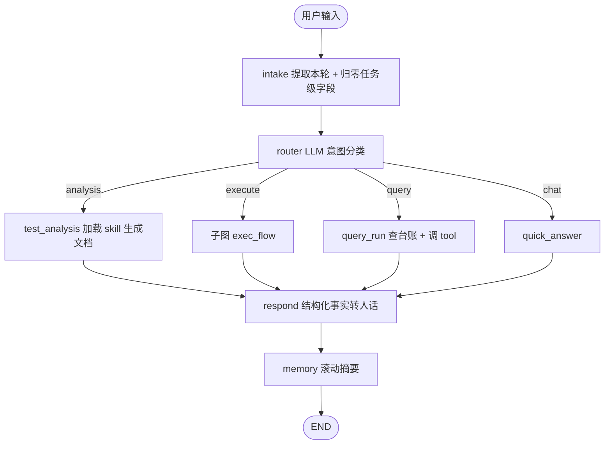
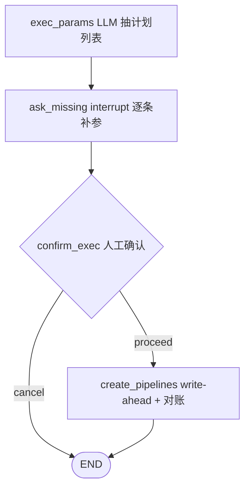
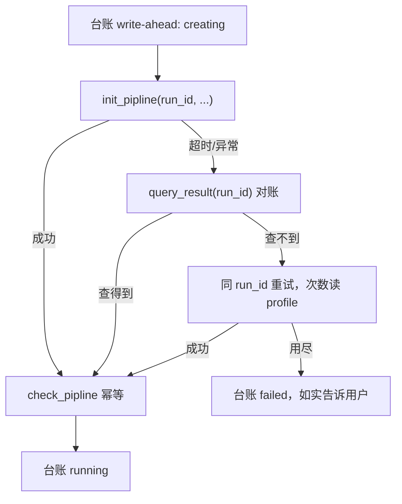

# 项目面试准备手册

面向「把这个项目讲清楚 + 扛住追问」的速查文档。分四部分：怎么快速掌握、怎么介绍、可能被问什么、已知短板怎么答。

---

## 一、三十分钟掌握这个项目

### 1. 一句话定位

> 给测试工程师用的命令行 AI Agent。用 LangGraph 把「测试分析 → 创建执行流水线 → 查执行结果」编排成一个可审计、带人工确认的确定性状态机，公司真实 tool 用 Protocol 抽象、mock 实现，接入时只换实现不改图。

### 2. 按这个顺序读代码（重要度从高到低）


| 顺序  | 文件                                                                                    | 看什么                                            |
| --- | ------------------------------------------------------------------------------------- | ---------------------------------------------- |
| 1   | [work_agent/graph/state.py](../work_agent/graph/state.py)                             | 全局数据契约。会话级 vs 任务级两层、`append_audit` 自定义 reducer |
| 2   | [work_agent/graph/main_graph.py](../work_agent/graph/main_graph.py)                   | 主图接线，102 行看懂整个流程                               |
| 3   | [work_agent/graph/subgraphs/exec_flow.py](../work_agent/graph/subgraphs/exec_flow.py) | 子图三层 schema（Input / Output / 私有）               |
| 4   | [work_agent/graph/nodes/exec_flow.py](../work_agent/graph/nodes/exec_flow.py)         | 核心业务：参数抽取 + 批量创建 + 超时对账                        |
| 5   | [work_agent/tools/protocols.py](../work_agent/tools/protocols.py)                     | 与公司系统的边界契约                                     |
| 6   | [work_agent/graph/nodes/respond.py](../work_agent/graph/nodes/respond.py)             | 统一出口：事实卡片 + 防编造 + 兜底                           |
| 7   | [work_agent/graph/nodes/hitl.py](../work_agent/graph/nodes/hitl.py)                   | `interrupt` / `Command(resume)` 的实际用法          |
| 8   | [work_agent/core/ledger.py](../work_agent/core/ledger.py)                             | 跨会话台账，`query_run` 的数据来源                        |


其余（`cli.py` / `llm.py` / `skills.py` / `checkpoint.py`）属于工程外围，扫一眼即可。

### 3. 跑起来看一遍

```powershell
.\.venv\Scripts\python.exe -m pytest tests -q          # 58 个测试
.\.venv\Scripts\python.exe -m work_agent.cli chat -v   # -v 看 audit 与 summary
```

REPL 里依次输入，能覆盖全部四条分支：

```text
分析一下 256T 下行
在 7.223.50.60 上跑 HF_20B_PUSCH_1Cell_200M_hf_001 版本 27B
7.223.50.60 跑 HF_A_001，7.223.60.11 跑 HF_B_001，版本 27B
刚才那次怎么样了
```


### 4. 整体数据流




执行子图内部：




### 5. 规模速记

约 2300 行业务代码 + 700 行测试，58 个单元测试。分层：`core`（配置/LLM/台账/checkpoint/skill）、`graph`（state/节点/子图）、`tools`（契约/mock/real 预留）、`cli`。

---


## 二、怎么介绍这个项目


### 30 秒版（自我介绍环节）

> 我做了一个给测试人员用的命令行 Agent。测试同事日常要做测试分析、在指定环境上创建流水线跑用例、再回来查结果，这三件事分散在不同系统里。我用 LangGraph 把它们编排成一个状态机，用户用自然语言说「在 7.223.50.60 上用 27B 版本跑这几个用例」，Agent 抽参数、跟你确认、批量创建流水线并落台账，之后还能问「刚才那次怎么样了」。重点不是模型有多聪明，而是**可审计、可确认、可对账**——因为这是要在公司内部真跑执行的。


### 2 分钟版（项目介绍环节）

分四段讲：

**1. 问题与约束。** 测试执行是高代价写操作：跑错环境、跑错版本会占用真实设备、干扰别人。所以从第一天起的约束就是：不能让模型自由决定要不要执行；参数不全宁可反问也不能猜；每一步要留痕。

**2. 架构选型。** 主干是确定性状态机而不是 ReAct 循环。我给自己定了一条判定标准——**能写成函数的是 tool，步骤能画死的是 flow，需要边想边试的才是 role**。对照下来：执行用例和查结果步骤固定，做成确定性 Flow，LLM 只负责一次结构化参数抽取；测试分析是开放文本、需要迭代，才做成 Role（同一个模型 + 加载 markdown 写的 skill 包当 system prompt）。这样 LLM 的不确定性被限制在单个节点内部，图的走向永远可预测。

**3. 几个关键设计。**

- **状态分层**：会话级（`messages`、`dialogue_summary`）跨轮累积，任务级每轮由 `intake` 显式归零，避免上一轮的 run_id 串到这一轮。
- **子图隔离**：执行流做成独立子图，有自己的 Input / Output / 私有 schema，父图状态里看不到 `exec_decision` 这种内部字段。
- **统一出口 respond**：所有分支产出的都是结构化 `summary`，最后由一个节点转成人话，并且用「事实卡片 + 禁止改写」的 prompt 约束防编造，LLM 挂了还有确定性兜底。
- **人工确认**：用 `interrupt` 暂停图、`Command(resume)` 恢复，缺参数和执行前确认都走这条路。

**4. 工程可靠性。** 这部分是我觉得最像后端的地方——`run_id` 由 Agent 生成后传给 `init_pipline`，相当于客户端幂等键；调用前先往台账写 `creating`（write-ahead），HTTP 超时时不换新 ID 盲重试，而是拿同一个 run_id 去查询接口对账，查得到说明服务端已建成，查不到才重试。这套逻辑和后端调下游服务的做法是一样的。

### 5 分钟版（技术深聊）

在 2 分钟版基础上补三块：

- **演进过程**：最早所有节点直接返回 dict 给用户看，试用后发现「不像大模型，像在读日志」，于是引入 `respond` 统一出口；接着发现多轮对话没记忆，「再跑一遍」会失败，于是把 `messages` 提升为会话级状态并注入上下文；再往后发现执行流塞在主图里状态污染严重，才拆成子图。**每一步都是先跑起来遇到问题、再改架构**，不是一开始就设计好的。
- **契约先行**：公司 tool 还没给到时，我按真实函数名（`init_pipline` / `check_pipline`）定义 Protocol，mock 实现连「用例名非法会被流水线拒绝」都模拟了。接入时只需在 `tools/real/` 写适配层 + registry 切换。
- **测试策略**：LLM 节点不测输出内容（不稳定），只测确定性部分——reducer 合并规则、参数校验、路由函数、台账 CRUD、respond 的事实卡片与兜底、超时对账的三个分支。用 fake tool 注入 `TimeoutError` 来测对账，不依赖真实网络。

---


## 三、可能被问的问题


### A. LangGraph / 框架层

**Q1：为什么用 LangGraph，不用 LangChain Agent 或者自己写循环？**

ReAct 式 Agent 让模型自己决定调哪个 tool、调几次，对「执行用例」这种写操作风险太高，而且出问题无法复现。LangGraph 的价值是把流程显式画成图：节点、边、条件边都是代码里写死的，模型只在节点内部做一次结构化输出。加上它原生支持 checkpointer 和 interrupt，人工确认和断点续跑不用自己造轮子。如果将来做「失败自动归因」那种需要边想边试的能力，我会在图里挂一个 ReAct 子图，而不是把主干改成自由循环。

**Q2：State 是怎么设计的？为什么要分两层？**

`TestFlowState` 是 TypedDict。会话级只有两个字段——`messages` 和 `dialogue_summary`，跨轮累积、靠 checkpointer 持久化；其余都是任务级，每轮由 `intake` 显式赋空值。分层的直接原因是踩过坑：同一个 thread 连续对话时，上一轮的 `run_id`、`summary` 会残留，导致这一轮明明是闲聊，`respond` 却拿着上一轮的执行结果去编回复。现在 `intake` 是唯一的重置点，新增字段时在那里加一行就行，不用维护外部的 `empty_state` 清单。

**Q3：**`audit` **那个自定义 reducer 是干什么的？**

LangGraph 的字段合并默认是覆盖，list 常用 `operator.add` 追加。审计轨迹要追加，但同一个 thread 跨轮复用时纯追加会无限增长，第三轮就分不清哪几条属于本轮。所以我写了 `append_audit`：默认追加，但识别一个重置哨兵 `{"__reset__": True}`，`intake` 每轮开头发一条，reducer 见到就丢掉历史。这样既保持了「每个节点只 return 自己那一条」的简洁写法，又让每轮 audit 是干净的。

```python
def append_audit(old, new):
    if any(rec.get(RESET_AUDIT) for rec in new):
        return [r for r in new if not r.get(RESET_AUDIT)]
    return (old or []) + (new or [])
```

**Q4：为什么要拆子图？直接在主图加节点不行吗？**

功能上行，但状态会污染。执行流有些字段只有它自己关心（比如用户确认结果 `exec_decision`），塞在顶层 state 里，别的分支也能看到、也可能误读。子图可以定义三套 schema：`ExecFlowInput` 声明父图传什么（用户输入、task_id、对话上下文），`ExecFlowOutput` 声明回传什么（计划、流水线列表、summary、audit），私有字段只在内部可见。还有个细节：`audit` 只出不进，不放在 Input 里，否则父图的 reducer 会把子图带进去的那份重复累加一次。

**Q5：HITL 是怎么实现的？**`interrupt` **恢复后会重复执行吗？**

节点里调 `interrupt(载荷)` 会抛出中断，图在此暂停并把载荷交给调用方；用户回答后用 `Command(resume=答案)` 再 invoke，`interrupt()` 直接返回这个答案，节点继续往下。要注意的是**节点函数会从头重新执行到 interrupt 那一行**，所以 interrupt 之前不能有副作用（不能先调 tool 再问人）。我在 `runtime.run_turn` 里包了一个循环处理连续中断，并设了 20 轮上限，防止用户一直回无效值导致死循环。另外 interrupt 依赖 checkpointer，没有 checkpointer 会直接报错——这个我踩过。

### B. 架构设计层

**Q6：你怎么判断一个能力该做成 tool、flow 还是 agent？**

我的标准是「需不需要自主决策」，而不是「需不需要调外部系统」。满足两条以上才升级为 Role：下一步做什么取决于上一步结果且分支无法穷举；需要在多个 tool 间自主选择、可能反复调；输出是开放文本需要迭代。对照本项目：执行用例的步骤是固定的（抽参数 → 确认 → 建流水线 → 启动），做成 Flow；测试分析是开放文本，做成 Role。这条标准帮我砍掉了很多「看起来很 AI 但其实是 if-else」的设计。

**Q7：怎么保证 Agent 不胡说八道？**

三层防线。第一，**结构化输出**：路由和参数抽取都用 `with_structured_output` 绑定 Pydantic schema，模型只能吐 schema 内的字段，不能自由发挥。第二，**代码校验**：抽出来的版本号必须在 `27B/27A/26B/26A` 枚举里、环境必须匹配 IP 正则，不合法就标记为缺失去反问用户，而不是让模型自圆其说。第三，**输出侧约束**：`respond` 把 run_id、用例名、路径这些引用性信息以 JSON「事实卡片」交给模型，prompt 里明确要求「只能引用给定事实，一个字符都不要改」，并且事实卡片里没有的东西不许提。另外 `respond` 是必经节点，LLM 抖动不能让整轮失败，所以有确定性的 `_fallback_reply` 兜底。

**Q8：多轮对话的记忆怎么处理的？**

分三层看。完整对话由 checkpointer 全量持久化，不丢；关键事实（run_id、用例、版本、环境、状态）落在 SQLite 台账里，跨会话可查——所以「上次那条怎么样了」走的是台账，跟对话窗口无关。喂给 LLM 的上下文才是有限的：默认注入最近 8 条，超过 12 条时 `memory` 节点会把窗口外的旧消息用 LLM 压成一段摘要存进会话级的 `dialogue_summary`，并用 `RemoveMessage` 把旧消息裁掉，之后注入的是「历史摘要 + 最近 8 条」。摘要 prompt 里要求用例名、run_id 这类引用性事实原文保留。

**Q9：为什么把参数校验放在代码里，而不是让模型自己判断？**

模型判断不稳定，而且没法测试。放在代码里我可以写单元测试锁死行为：`_classify_env("7.223.50.60")` 必须是 physical、`_classify_env("3BBL_86_1BBL86")` 必须是 logical 并进入缺失列表。反过来说，用例名我**故意不校验**——公司流水线自己会验，Agent 多做一层校验只会造成「本地说非法但平台其实认」的不一致。边界划在哪，取决于谁是权威。

### C. 工程可靠性层

**Q10（重点）：创建流水线的 HTTP 请求超时了，怎么办？**

超时最麻烦的地方是**它不等于失败**——服务端可能已经创建成功，只是响应没回来。如果换个新 run_id 重试，就会建出两条重复流水线，占用真实设备。我的做法是把 `run_id` 变成客户端生成的幂等键，创建时传给 `init_pipline`，于是就能对账：




再加两条纪律：调用前先往台账写 `creating`（write-ahead），进程崩在中途也留有悬案可以事后对账，而不是凭空消失；批量创建时单条失败不阻断其余，最终按「全成功 / 部分成功 / 全失败」三态汇报。这套逻辑我用 fake tool 注入 `TimeoutError` 写了三个测试覆盖：超时但已创建、超时且未创建、重试用尽。

**Q11：你说 Agent 和后端很像，具体像在哪？**

执行链路本质就是一个编排服务：接收请求（用户自然语言）、参数校验、调下游、写状态、返回响应。幂等、重试、对账、write-ahead 这些后端常识在这里一条都不能少。区别只在于参数解析这一步从「解析 JSON」变成了「让 LLM 抽结构化字段」——而 LLM 是个**输出不可信的中间件**，所以它的输出必须当成外部输入来校验，不能当成可信数据直接用。想通这一点之后，很多设计就自然了：schema 约束是入参校验，事实卡片是防越权，兜底回复是降级策略。

**Q12：怎么保证接入公司真实 tool 时不用改图？**

所有外部调用走 `Protocol`。图和节点只 import `work_agent.tools.registry.get_pipeline_tool()`，拿到的是满足 `PipelineTool` 协议的对象，具体是 mock 还是 real 由 `.env` 里的 `TOOL_BACKEND` 决定。Protocol 的方法名我刻意贴着公司真实函数写（包括 `init_pipline` 这个拼写），接入时只需在 `tools/real/` 写一层薄适配。registry 用 `lru_cache` 保证进程内单例——mock 把流水线状态存在实例内存里，换实例就丢了。

**Q13：这个项目怎么测？LLM 的输出不稳定怎么办？**

不测 LLM 输出内容，只测确定性部分，58 个测试全部不需要网络：reducer 的合并与重置、参数校验（IP 分类、版本枚举、缺失标记）、路由函数、mock tool 的契约行为、台账 CRUD 与边界（比如二次 upsert 传空 `report_path` 不能抹掉已有值）、`respond` 的事实卡片过滤规则和兜底文案、`memory` 的阈值与裁剪条数、超时对账的三个分支。LLM 节点在测试里 monkeypatch 掉。这样重构时有安全网——事实上这套测试在我把执行流从「轮询模式」重构成「流水线模式」时救了我好几次。

### D. 可能的追问 / 压力测试

**Q14：如果用户一句话要在 5 个环境跑 100 个用例呢？**

现在的设计是「不同环境拆成多条流水线，同环境多用例合并为一条」，所以是 5 次 `init_pipline`，每次带 20 个用例。确认页会展示每条计划的环境、版本和用例数（超过 3 条只列前 3 个 + 总数），避免刷屏。风险点是 LLM 抽 100 个长用例名容易漏或截断——现阶段靠 prompt 强调「按原文提取不要截断」，更稳的做法是支持从文件读用例列表，这是我列在后面要做的。

**Q15：如果 LLM 把意图分错了会怎样？**

分错到 `execute` 是最坏情况，但因为有强制的人工确认节点，用户会在确认页看到「要在哪个环境跑什么」，直接回 no 就取消了，不会误触发。分错到 `chat` 或 `query` 只是回答得不对，用户换个说法即可。这也是我坚持保留人工确认的原因——**不指望模型不出错，而是让出错的代价可控**。

**Q16：并发怎么办？多个人同时用会不会打架？**

现在是单用户 CLI，每个会话一个 `thread_id`，checkpointer 按 thread 隔离。台账是 SQLite，`run_id` 是主键，多进程写会有锁竞争但不会写坏。真要做多用户，我会把台账换成公司现有的数据库，checkpointer 换成 Postgres 版本，CLI 换成服务端 + 前端；图本身不用动，这是选 LangGraph 时就考虑到的。

**Q17：成本怎么控制？**

每轮固定两次 LLM 调用（router + respond），执行分支多一次参数抽取。`memory` 只在消息超过 12 条时才触发，正常对话完全不花钱。分类和抽参数都用 `temperature=0` 且输出很短。真正贵的是测试分析那种长文本生成，但那是按需触发的。如果要进一步降本，router 可以先用规则前置匹配明显意图，命中就不调模型。

**Q18：这个项目最难的地方 / 你学到了什么？**

最难的不是写代码，是**判断哪些地方该用 LLM、哪些地方不该用**。一开始我想让模型做更多事，比如自己判断参数够不够、自己决定要不要重试，结果就是行为不可预测、没法测试、出了问题不知道怎么复现。后来退回到「模型只做一次结构化抽取，其余全是确定性代码」，反而又稳又好调试。另一个体会是超时那块——写的时候才意识到 Agent 调 tool 和后端调下游服务面临的是同一类问题，之前学的幂等、对账那套直接能用上。

---


## 四、已知短板（被问到就大方承认）

主动说出来比被追问出来好，而且要带上「为什么现在不做」和「打算怎么做」。


| 短板               | 现状与理由                          | 计划                                              |
| ---------------- | ------------------------------ | ----------------------------------------------- |
| 逻辑组网未支持          | 只支持物理 IP；型号映射表（86 是 BBH 等）还没拿到 | 拿到映射 markdown 后加解析层，识别「85+86 环境」这类说法            |
| 用例分析 tool 是 mock | 公司侧接口未就绪                       | Protocol 已定义，接入只需写 real 实现                      |
| 无失败归因            | MVP 边界划在「创建并启动流水线」，结果用户去流水线前端看 | Phase 2 做归因 Role（版本问题 / 用例异常 / 环境异常三分类）         |
| 单用户 CLI          | 当前是个人效率工具                      | 图不用改，换 checkpointer 和台账存储即可服务化                  |
| 无 RAG            | 资料量小，全量注入准确率更高、无检索误差           | `SkillLoader.select_references` 已留钩子，资料变多时换检索实现 |
| 摘要质量依赖 LLM       | 压缩可能丢细节                        | 关键事实已落台账，摘要只影响指代消解；必要时改成结构化摘要                   |


---


## 五、临场备忘

**一定要说出口的关键词**：确定性状态机、Protocol 抽象、状态分层、子图隔离、人工确认、幂等键与对账、事实卡片防编造、确定性兜底。

**讲故事的钩子**（比罗列技术点更抓人）：

1. 「试用之后我发现它回答得不像大模型，像在读日志」→ 引出 `respond` 统一出口。
2. 「第二轮说『再跑一遍』它失败了」→ 引出会话级状态与上下文注入。
3. 「如果创建流水线的 HTTP 超时了怎么办」→ 引出幂等键与对账，这是最能体现工程素养的一段。

**要避免的说法**：不要说「用 AI 自动完成测试」，这会引来「怎么保证不出错」的质疑；要说「用 AI 做参数理解和信息组织，执行决策仍在人手上」。